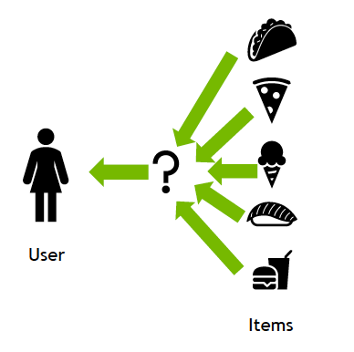
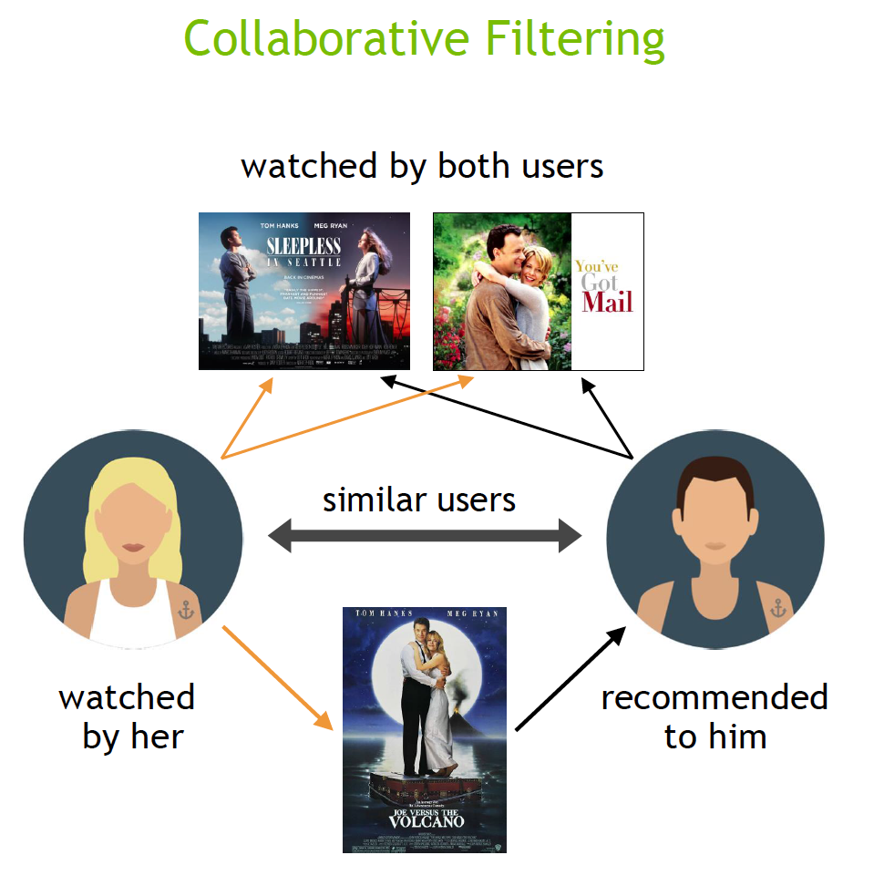
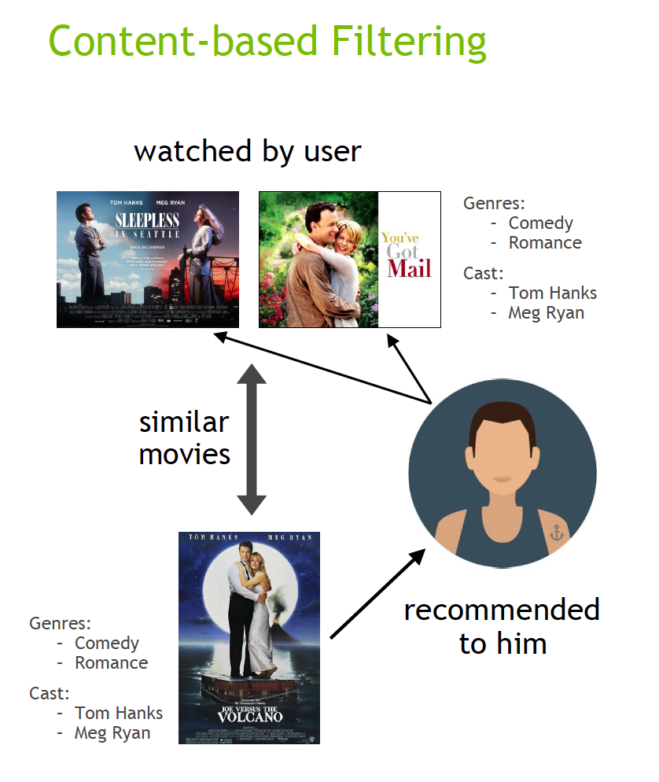
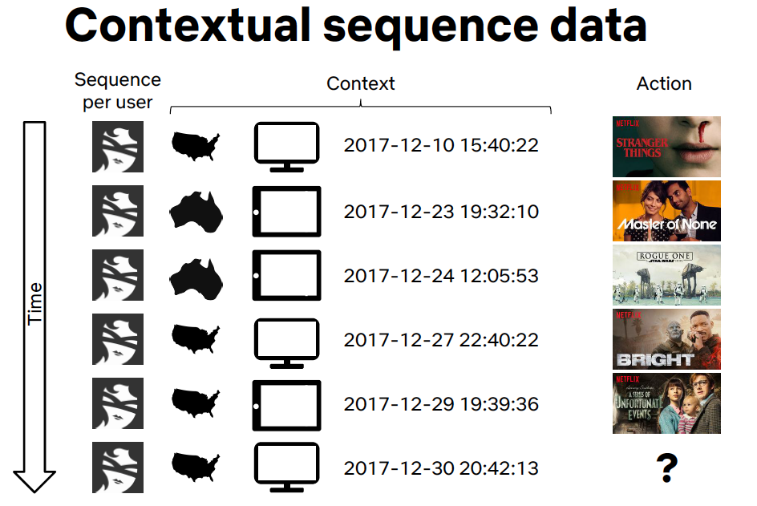
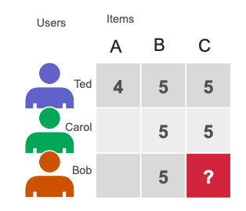
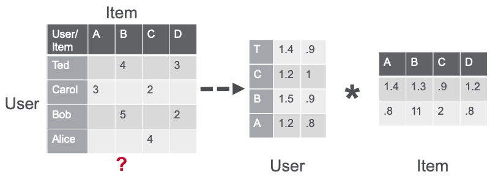

## O QUE É UM SISTEMA DE RECOMENDAÇÃO?

Um sistema de recomendação é um algoritmo de inteligência artificial (IA), geralmente associado ao aprendizado de máquina, que utiliza uma grande base de dados para sugerir ou recomendar produtos adicionais aos consumidores. Essas recomendações podem ser baseadas em vários critérios, incluindo compras anteriores, histórico de buscas, informações demográficas e outros fatores. Os sistemas de recomendação são altamente úteis, pois ajudam os usuários a descobrir produtos e serviços que, de outra forma, poderiam não encontrar sozinhos.

Esses sistemas são treinados para entender as preferências, decisões anteriores e características de pessoas e produtos, utilizando dados coletados sobre suas interações. Isso inclui impressões, cliques, curtidas e compras. Devido à sua capacidade de prever interesses e desejos dos consumidores de forma altamente personalizada, os sistemas de recomendação são amplamente utilizados por provedores de conteúdo e produtos. Eles podem direcionar consumidores a praticamente qualquer produto ou serviço de interesse, como livros, vídeos, aulas de saúde e roupas.

 

  

 

## TIPOS DE SISTEMAS DE RECOMENDAÇÃO

Embora existam uma grande quantidade de algoritmos e técnicas de recomendação, a maioria se enquadra em três categorias amplas: filtragem colaborativa, filtragem de conteúdo e filtragem contextual.

Os algoritmos de filtragem colaborativa recomendam itens (essa é a parte de filtragem) com base nas informações de preferência de muitos usuários (essa é a parte colaborativa). Essa abordagem utiliza a semelhança no comportamento de preferências dos usuários, dado que, a partir das interações anteriores entre usuários e itens, os algoritmos de recomendação aprendem a prever interações futuras. Esses sistemas de recomendação constroem um modelo com base no comportamento passado de um usuário, como itens comprados anteriormente ou avaliações dadas a esses itens, e decisões semelhantes de outros usuários. A ideia é que, se algumas pessoas tomaram decisões e realizaram compras semelhantes no passado, como a escolha de um filme, existe uma alta probabilidade de que elas concordem com futuras seleções. Por exemplo, se um sistema de recomendação por filtragem colaborativa sabe que você e outro usuário compartilham gostos semelhantes em filmes, ele pode recomendar um filme para você que sabe que esse outro usuário já gostou.

 

  

 

A filtragem de conteúdo, por outro lado, utiliza os atributos ou características de um item (essa é a parte de conteúdo) para recomendar outros itens semelhantes às preferências do usuário. Essa abordagem é baseada na semelhança entre as características do item e do usuário, dada a informação sobre o usuário e os itens com os quais ele interagiu (por exemplo, a idade do usuário, a categoria de cozinha de um restaurante, a avaliação média de um filme), modelando a probabilidade de uma nova interação.

Por exemplo, se um sistema de recomendação por filtragem de conteúdo perceber que você gostou dos filmes You’ve Got Mail e Sleepless in Seattle, ele pode recomendar outro filme com gêneros e/ou elenco semelhantes, como Joe Versus the Volcano.

 

  

 

Sistemas de recomendação híbridos combinam as vantagens dos tipos acima para criar um sistema de recomendação mais abrangente.

A filtragem contextual inclui informações contextuais dos usuários no processo de recomendação. A Netflix falou na NVIDIA GTC sobre como melhorar as recomendações ao enquadrar uma recomendação como uma previsão sequencial contextual. Essa abordagem utiliza uma sequência de ações contextuais do usuário, além do contexto atual, para prever a probabilidade da próxima ação. No exemplo da Netflix, dada uma sequência para cada usuário — país, dispositivo, data e hora em que assistiram a um filme —, eles treinaram um modelo para prever o que assistir a seguir.

 

  

 

## COMO RECOMENDADORES FUNCIONAM?

Como um modelo de recomendação faz suas recomendações depende do tipo de dado que você possui. Se você tem apenas dados sobre quais interações ocorreram no passado, provavelmente estará interessado em filtragem colaborativa. Se você tem dados que descrevem o usuário e os itens com os quais ele interagiu (por exemplo, a idade do usuário, a categoria de cozinha de um restaurante, a avaliação média de um filme), você pode modelar a probabilidade de uma nova interação, dadas essas propriedades no momento atual, adicionando filtragem de conteúdo e contextual.

 

### Fatoração de Matrizes para Recomendação

As técnicas de fatoração de matrizes (MF) são o núcleo de muitos algoritmos populares, incluindo word embedding e modelagem de tópicos, e se tornaram uma metodologia dominante dentro da recomendação baseada em filtragem colaborativa. A MF pode ser usada para calcular a similaridade nas classificações ou interações dos usuários para fornecer recomendações.

No exemplo simples de uma matriz de usuários e itens abaixo, Ted e Carol gostam dos filmes B e C. Bob gosta do filme B. Para recomendar um filme a Bob, a fatoração de matrizes calcula que usuários que gostaram de B também gostaram de C, então C é uma possível recomendação para Bob.

 

  

 

A fatoração de matrizes usando o algoritmo de alternating least squares (ALS) aproxima a matriz esparsa de classificações de usuários e itens (matriz u-by-i) como o produto de duas matrizes densas: a matriz de fatores de usuários e a matriz de fatores de itens, de tamanhos u X f e f X i (onde u é o número de usuários, i é o número de itens e f é o número de características latentes).

As matrizes de fatores representam características latentes ou ocultas que o algoritmo tenta descobrir. Uma matriz tenta descrever as características latentes ou ocultas de cada usuário, e a outra tenta descrever as propriedades latentes de cada item (por exemplo, filmes). Para cada usuário e para cada item, o algoritmo ALS aprende iterativamente (f) "fatores" numéricos que representam o usuário ou o item.

Em cada iteração, o algoritmo fixa uma das matrizes de fatores e otimiza a outra, repetindo esse processo até que o algoritmo convirja para uma solução. Esse processo alternado de otimização permite que o modelo aprenda padrões e relações ocultas entre usuários e itens, o que resulta em recomendações personalizadas.

 

  

 

## FONTE

[NVidia Corporation](https://www.nvidia.com/en-us/glossary/recommendation-system/)
