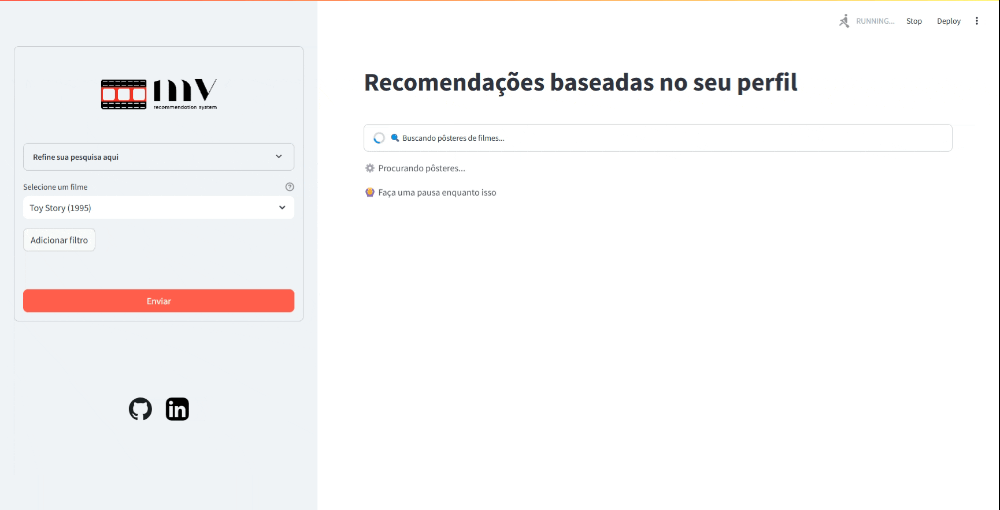

# MV RECOMMENDER SYSTEM

<p align="center">
  
</p>

<br>

<p align="center">
  
</p>

<br>

## DESCRIÇÃO

Este projeto trata-se de uma aplicação, desenvolvida em Python por meio de bibliotecas como Streamlit, Pandas, Scipy, ScikitLearn, dentre outras. Por meio do website, o usuário pode escolher de 1 a 3 filmes que é referência para ele, e o sistema, através de um algoritmo de Machine Learning, retornará para ele uma lista de recomendações, a partir de uma filtragem colaborativa.

<br>

## REQUISITOS

- Python: versão 3.8 ou superior
- Docker: qualquer versão
- Docker-Compose: qualquer versão

<br>

## CONFIGURAÇÃO

### 1. Clone o repositório

```bash
git clone <URL_DO_REPOSITORIO>
cd nome-do-repositorio
```

### 2. Crie a sua chave de API no site TMDB

1. Acesse o site oficial do TMDB: https://www.themoviedb.org.
2. Acesse a Página de Configurações da Conta.
3. Navegue até a Aba "API".
4. Solicite uma Chave de API.
5. Crie um arquivo .env na raiz do projeto.
6. Crie uma variável chamada "TMDB_API_KEY".
7. Atribua à variável a sua chave da API.

### 3. Docker

```docker-compose
docker compose up -d
```

Agora a aplicação estará acessível em `http://localhost:8501`.

<br>

## ESTRUTURA DE DIRETÓRIOS

```plaintext
MV_RECOMMENDER_SYSTEM/
├── data/
│   ├── links.csv
│   ├── movies.csv
│   └── ratings.csv
├── assets/
│   ├── gif/
│   |   ├── homepage.gif
│   └── img/
│       ├── img1.png
│       ├── img2.png
│       ├── img3.png
│       ├── img4.png
│       ├── img5.png
│       ├── img6.png
│       ├── mv-horizontal-logo.png
│       └── mv-square-logo.png
├── recommender/
│   ├── __init__.py
│   └── model.py
├── src/
│   ├── __init__.py
│   └── app.py
├── utils/
│   ├── __init__.py
│   └── utils_functions.py
├── .env
├── .gitignore
├── docker-compose.yml
├── Dockerfile
├── requirements.txt
├── LEARN.md
└── README.md
```

- **`data/links.csv`**: Contém o mapeamento entre IDs de filmes usados no dataset de ratings e IDs externos, como do IMDb e TMDB.
- **`data/movies.csv`**: Contém informações sobre os filmes, incluindo título, gênero e ID.
- **`data/ratings.csv`**: Contém os ratings dados pelos usuários aos filmes, incluindo informações como ID do usuário, ID do filme e avaliação.
- **`assets/`**: Contém imagens e gifs utilizados tanto na aplicação quanto no README.
- **`recommender/model.py`**: Contém a lógica do modelo de recomendação, como o algoritmo KNN e o processamento de dados para gerar as recomendações.
- **`src/app.py`**: Código principal da aplicação. Responsável por rodar o servidor Tornado, rodar o modelo de Machine Learning e também lidar com a API externa do TMDB.
- **`utils/utils_functions.py`**: Contém funções auxiliares e utilitários que são usados em diferentes partes do projeto.
- **`.env`**: Contém variáveis de ambiente, como credenciais ou configurações sensíveis, para serem usadas pela aplicação.
- **`.gitignore`**: Define arquivos e pastas a serem ignorados pelo controle de versão do Git (ex.: `.env`, arquivos temporários, etc.).
- **`docker-compose.yml`**: Configuração para a orquestração de containers Docker, facilitando o gerenciamento de serviços necessários.
- **`Dockerfile`**: Instruções para criar uma imagem Docker da aplicação, especificando dependências e configurações necessárias.
- **`requirements.txt`**: Lista de dependências Python que devem ser instaladas para o projeto funcionar.
- **`LEARN.md`**: Guia sobre o funcionamento de sistemas de recomendação para estudantes e curiosos.
- **`README.md`**: Documentação principal do projeto, incluindo informações sobre instalação, configuração e uso do sistema.

<br>

## CONTRIBUIÇÃO

O projeto possui muitas oportunidades de melhoria. Caso você se interesse e queira deixar sua contribuição, por favor, faça um fork do repositório, crie uma branch para suas alterações, e depois abra um pull request.

1. Faça um fork do projeto
2. Crie uma branch (`git checkout -b feature/AmazingFeature`)
3. Adicionar as mudanças (`git add .`)
4. Commit suas alterações (`git commit -m 'Add some AmazingFeature'`)
5. Push para a branch (`git push origin feature/AmazingFeature`)
6. Abra um pull request

<br>

<br>

# DA APLICAÇÃO

## PARÂMETROS DOS COMPONENTES

1. Slider  
    Permite que o usuário escolha quantos filmes gostaria de ver como retorno na recomendação.
    - Valor Mínimo: 1
    - Valor Máximo: 10
    - Default: 10

2. Dropdown  
    Permite que o usuário escolha os filmes de referência. É com base neles que o recomendador buscará indicações.
    - Conteúdo: Lista de filmes

3. Submit Button  
    Botão de envio do formulário, para chamar o recomendador e processar o retorno.

4. Add Filter Button  
    Botão opcional, que adiciona mais Dropdowns na tela. Permite que o usuário passe como referência ao recomendador 2 ou 3 filmes em vez de somente 1.

<br>

<br>

# DO MODELO DE RECOMENDAÇÃO

## HIPERPARÂMETROS DO MODELO

a) n-neighbors: definido pelo usuário no slider. Default recebe 10

b) algorithm: brute (Algoritmo de força bruta. Preferível pelo tamanho pequeno do dataset)

c) metric: cosine (Similaridade Cosseno, pela esparsividade dos dados)
