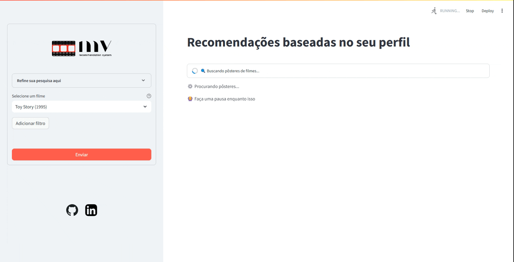

<h1 align="center">MV-Recommender-System</h1>

<p align="center">
  
</p>

<p align="center">
  <a href="#-about"><strong>About</strong></a> •
  <a href="#-features"><strong>Features</strong></a> •
  <a href="#-installation"><strong>Installation</strong></a> •
  <a href="#-usage"><strong>Usage</strong></a> •
  <a href="#-architecture"><strong>Architecture</strong></a> •
  <a href="#-machine-learning-details"><strong>ML Details</strong></a> •
  <a href="#-roadmap"><strong>Roadmap</strong></a> •
  <a href="#-license"><strong>License</strong></a>
</p>

<p align="center">
  
  
  
  
  
  
</p>

<br>

<p align="center">
  
</p>

<br>

## 📖 About

**MV Recommender System** is a web application (FastAPI API + React SPA) that delivers
personalized movie recommendations via item-item collaborative filtering. The KNN
model is trained offline on the MovieLens dataset; the result — pre-computed
neighbors per movie — is exported as compact, versioned parquet artifacts, so the
app works **immediately after cloning**, with no need to download the raw dataset
(hundreds of MB) or retrain anything.

Pick up to three movies, choose how many recommendations you want, and get posters
and metadata enriched by TMDB.

> Discover your next favorite movie. Powered by collaborative filtering.

<br>

## ✨ Features

| Feature | Description |
|---|---|
| **Item-item collaborative filtering** | Pre-computed KNN (cosine similarity), MovieLens |
| **1-3 movie selection** | Autocomplete with debounce, up to 3 references |
| **Adjustable recommendations** | 1-10 results |
| **Genre/year/rating filter** | Refines the search for reference movies |
| **Trending movies** | Bayesian weighted rating, computed offline |
| **Watchlist** | Saves movies locally (localStorage), no login needed |
| **Posters via TMDB** | Backend proxies the call — API key never exposed to the client |

<br>

## ⚙️ Requirements

- **Docker + Docker Compose** (recommended), or
- **[uv](https://docs.astral.sh/uv/)** (manages Python 3.12 automatically) and **Node 20+** to run locally without containers
- **TMDB API Key** — [free sign-up](https://www.themoviedb.org)

<br>

## 🚀 Installation

### Option 1: Docker Compose (production)

```bash
git clone https://github.com/Paulogb98/MV-Recommender-System.git
cd MV-Recommender-System
cp .env.example .env   # fill in TMDB_API_KEY

docker compose up -d --build
```

- Frontend: http://localhost
- Backend (Swagger): http://localhost:8000/docs

### Option 2: Docker Compose (dev, hot-reload)

```bash
docker compose -f docker-compose.yml -f docker-compose.dev.yml up --build
```

- Frontend (Vite dev server): http://localhost:5173
- Backend: http://localhost:8000

### Option 3: Local, without Docker

```bash
# Backend
uv sync --group dev       # installs backend + test deps into .venv (Python 3.12, managed by uv)
cp .env.example .env      # fill in TMDB_API_KEY
uv run uvicorn app.main:app --reload --app-dir backend

# Frontend (another terminal)
cd frontend
npm install
cp .env.example .env
npm run dev
```

The ML artifacts (`ml/artifacts/*.parquet`) already ship ready in the repo — no
extra download is needed to run the app. You only need the raw dataset if you want
to **retrain** the model (see [Retraining](#retraining-the-model)).

<br>

## 📖 Usage

1. Type in the search field (autocomplete) and pick up to 3 reference movies.
2. Optionally, refine the search by genre/year/minimum rating.
3. Adjust the slider from 1 to 10 recommendations.
4. Click "Generate recommendations".
5. Explore the "Trending" section to discover popular movies regardless of search.
6. Click the "+" on any card to add it to your watchlist (♥ icon in the header).

<br>

## 🏗️ Architecture

```
┌─────────────────────────────┐        ┌──────────────────────────────┐
│   Frontend (React + Vite)   │  HTTP  │      Backend (FastAPI)        │
│  Header · Hero · SearchBox  │◄──────►│  routers -> services          │
│  FilterPanel · ResultsGrid  │        │  Catalog / Recommender /      │
│  Trending · Watchlist       │        │  Trending / Poster            │
└─────────────────────────────┘        └───────────────┬────────────────┘
                                                         │ loaded once at startup
                                                         ▼
                                        ┌──────────────────────────────┐
                                        │   ml/artifacts/*.parquet      │
                                        │  neighbors · metadata · trend │
                                        └───────────────┬────────────────┘
                                                         │ generated offline by
                                                         ▼
                                        ┌──────────────────────────────┐
                                        │   ml/train.py (KNN cosine)    │
                                        │   MovieLens dataset (ratings) │
                                        └──────────────────────────────┘

Backend also proxies /api/posters/{movie_id} -> TMDB API (hides the key).
```

### Folder structure

```
MV-Recommender-System/
├── backend/          # FastAPI (routers, services, schemas, tests)
├── frontend/         # React + TypeScript + Vite
├── ml/                # train/export pipeline + compact versioned artifacts
│   └── artifacts/     # movie_neighbors.parquet, movie_metadata.parquet, trending.parquet
├── data/              # movies.csv, links.csv, ratings.csv — all gitignored, retraining only (see data/README.md)
├── assets/            # logos and demo gif
├── pyproject.toml / uv.lock   # single Python dependency manifest (backend + ml)
├── docker-compose.yml / docker-compose.dev.yml
└── README.md
```

### Frontend structure

```
frontend/src/
├── api/          # HTTP client and backend calls
├── components/   # components by area (Header, SearchBox, ResultsGrid, ...)
├── context/      # Watchlist (Context API)
├── hooks/        # useMovieSearch, useRecommendations, useTrending, usePoster
├── styles/       # tokens.css (design tokens), global.css (keyframes/reset), components.css
└── types/        # shared types (Movie, RecommendationResult, ...)
```

| Command (run inside `frontend/`) | Description |
|---|---|
| `npm run dev` | Development server (hot reload) |
| `npm run build` | Production build (`dist/`) |
| `npm run test` | Tests (Vitest + Testing Library) |
| `npm run lint` | Lint (oxlint) |

<br>

## 🧪 Machine Learning Details

**Algorithm:** item-item K-Nearest Neighbors, cosine similarity (`scikit-learn`,
`algorithm="brute"`). For each movie, the top-25 most similar neighbors are
pre-computed offline and served from a parquet artifact — the backend loads this
once at startup, without retraining or reloading anything on every request.

**Trending:** Bayesian weighted rating (IMDB Top 250 style) — combines number of
ratings and average rating, preventing movies with few high ratings from
dominating the top.

**Dataset:** MovieLens.

### Retraining the model

Full steps, hyperparameters, and the dataset layout live in
[`ml/README.md`](ml/README.md) — the short version is `uv sync --extra ml`
followed by `uv run python -m ml.train`, which regenerates the 3 files in
`ml/artifacts/`.

<br>

## 🛠️ Technology Stack

| Layer | Technology |
|---|---|
| **Backend** | FastAPI, Uvicorn, Pydantic Settings, httpx |
| **Frontend** | React 19, TypeScript, Vite |
| **ML** | scikit-learn, pandas, pyarrow (parquet) |
| **Dependency management** | [uv](https://docs.astral.sh/uv/) (single `pyproject.toml`/`uv.lock` for backend + ml) |
| **Tests** | pytest (backend), Vitest + Testing Library (frontend) |
| **Containerization** | Docker, Docker Compose, nginx (serves the static build) |

<br>

## 🔧 Troubleshooting

| Problem | Solution |
|---|---|
| `TMDB API Error: 401` | Check `TMDB_API_KEY` in `.env` |
| Poster doesn't show up | `tmdb_id` may be null for the movie, or the TMDB key is missing/rate-limited — falls back to a placeholder |
| Frontend can't connect to backend | Check `VITE_API_BASE_URL` (frontend/.env) and `CORS_ORIGINS` (.env) |
| `docker compose up` fails | `docker compose logs backend` / `docker compose logs frontend` |
| Want to retrain with new data | See [Retraining](#retraining-the-model) |

<br>

## 🚀 Roadmap

### ✅ Implemented
- ✅ FastAPI backend + React/TypeScript/Vite frontend
- ✅ Compact pre-computed ML artifacts (parquet), versioned in git
- ✅ Genre/year/minimum rating filter
- ✅ Local watchlist (localStorage)
- ✅ Trending movies section
- ✅ Automated tests (backend and frontend)
- ✅ Multi-service Docker (production + dev with hot-reload)

### 💭 Future
- 💭 User ratings/feedback
- 💭 Neural Collaborative Filtering (NCF) / hybrid system
- 💭 Social recommendations
- 💭 Authentication and cross-device synced watchlist
- 💭 Mobile app

<br>

## 🤝 Contributing

```bash
git checkout -b feature/YourFeature
# ... your changes ...
git commit -m 'feat: add YourFeature'
git push origin feature/YourFeature
```

<br>

## 📄 License

MIT — see [LICENSE](LICENSE).

<br>

## 🙏 Acknowledgments

- 🎬 **MovieLens** — dataset and research base
- 🎥 **TMDB (The Movie Database)** — posters and metadata
- 🤖 **scikit-learn** — machine learning tools
